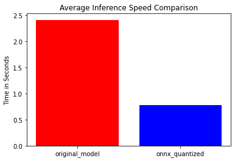
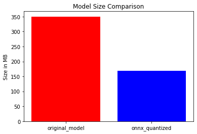

# xs_blenderbot_onnx
quantized and ONNX version of facebook/blenderbot_small-90M model huggingface

# Business Problem

&bull; Transformers models can be resource-intensive, requiring significant computational power and memory to run. This can make them difficult to deploy in resource-constrained environments, such as on mobile devices or on edge devices with limited processing capabilities.
<br>&bull; quantized and ONNX version of the Transformers model, you have made it possible to run the model more efficiently and with lower resource requirements.

# Model Benefits 

Faster cpu inference (2.5~3x inference speed)
<center></center>

Halfed model size 350 mb -> 168 mb
<center></center>

model link: https://huggingface.co/remzicam/xs_blenderbot_onnx

you can use the model with huggingface generate function with its all parameters


To see inference speed comparison:

[](https://colab.research.google.com/github/remzicam/xs_blenderbot_onnx/blob/main/inference_speed.ipynb)

## Usage

With text generation pipeline

```python
>>>from blender_model import TextGenerationPipeline

>>>max_answer_length = 100
>>>response_generator_pipe = TextGenerationPipeline(max_length=max_answer_length)
>>>utterance = "Hello, how are you?"
>>>response_generator_pipe(utterance)
i am well. how are you? what do you like to do in your free time?
```
Or you can call the model

```python
>>>from blender_model import OnnxBlender
>>>from transformers import BlenderbotSmallTokenizer
>>>original_repo_id = "facebook/blenderbot_small-90M"
>>>repo_id = "remzicam/xs_blenderbot_onnx"
>>>model_file_names = [
    "blenderbot_small-90M-encoder-quantized.onnx",
    "blenderbot_small-90M-decoder-quantized.onnx",
    "blenderbot_small-90M-init-decoder-quantized.onnx",
]
>>>model=OnnxBlender(original_repo_id, repo_id, model_file_names)
>>>utterance = "Hello, how are you?"
>>>inputs = tokenizer(utterance,
                    return_tensors="pt")
>>>outputs= model.generate(**inputs,
                        max_length=max_answer_length)
>>>response = tokenizer.decode(outputs[0],
                        skip_special_tokens = True)
>>>print(response)
i am well. how are you? what do you like to do in your free time?
```

# Tools used

<br>&bull; pytorch 
<br>&bull; onnx (model conversion)
<br>&bull; onnxruntime (model inference)
<br>&bull; transformers (chatbot model)
<br>&bull; huggingface hub (model uploading)

## Credits
To create the model, I adopted codes from https://github.com/siddharth-sharma7/fast-Bart repository.
